# Face Depth Frame Mancer

## Version 2025.1.1

**Face Depth Frame Mancer** is an Unreal Engine plugin that generates **face depth frames** from video files **without the need for a depth camera**. It first extracts **image frames** and **audio**, **creates face depth frames**, **creates capture data footage** and then you can use it to create **high-quality MetaHuman performances**, elevating your virtual characters and animation workflows.

### What's New in 2025.1.1
- **Bug Fixes**: Fixed an issue with frame extraction for videos with frame rates below 30fps.
- **Documentation Enhancements**: Included guidelines for recommended video specifications.

## Features

- **Extract Image Frames**: Extract frames from a video file and save them as `ImgMediaSource`.
- **Extract Audio**: Extract audio from the video file.
- **Create Depth Frames**: Generate face depth frames based on the video and save them as `ImgMediaSource`.
- **Capture Data Footage**: Create a unified capture data asset combining video frames, depth frames, and audio (requires the MetaHuman Plugin to be enabled).
- **Sharable Settings**: Save and load depth map creation settings to share between projects.

## Installation

1. Open the Unreal Engine Editor.
2. Go to **Edit > Plugins**.
3. In the **Installed** tab, locate and enable the **MH Face Depth Frame Mancer** plugin.   
   - For full functionality, it’s recommended to also enable the **Epic Games MetaHuman Plugin**.
        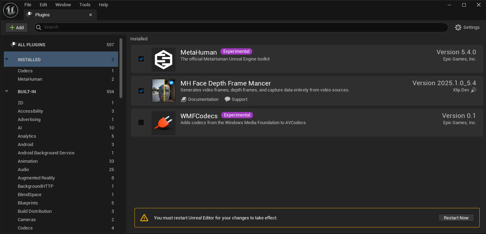

4. **Restart Unreal Engine if prompted.**

   > **Note:** When opening the project for the first time, Unreal Engine will automatically install the required Python packages, which may take some time. Please be patient during this process.

   The plugin depends on the following Python packages, which Unreal Engine will install in your project’s `Intermediate` folder:

   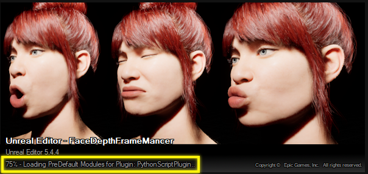 
   - **opencv-python**: 4.10.0.84
   - **mediapipe**: 0.10.18
   - **trimesh**: 4.5.2
   - **matplotlib**: 3.9.2
   - **openexr**: 3.3.1
   - **imageio-ffmpeg**: 0.5.1

## Usage

   Before starting, please review the following guidelines to ensure proper facial capture recording:
   [MetaHuman Facial Performance Capture Guidelines](https://dev.epicgames.com/documentation/en-us/metahuman/metahuman-facial-performance-capture-guidelines).

### 1. Extract Frames and Audio from Video

1. **Drag and Drop a Video into Content Browser**
   Place your video file in the Unreal Engine Content Browser, which will automatically create a `FileMediaSource` asset.

   **Recommended Video Settings**:  
   - **Aspect Ratio**: 9:16  
   - **Frame Rate**: 30 fps or higher 

   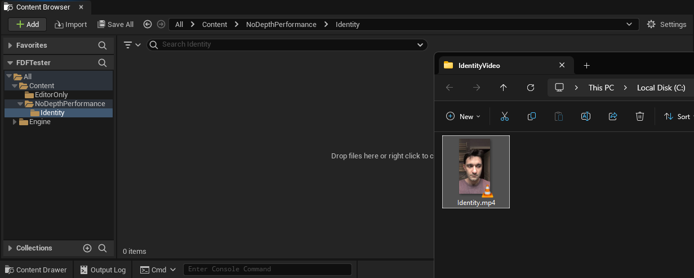

2. **Right-Click on the FileMediaSource**

   Go to **Scripted Asset Actions** and select **Extract Video Frames**.

   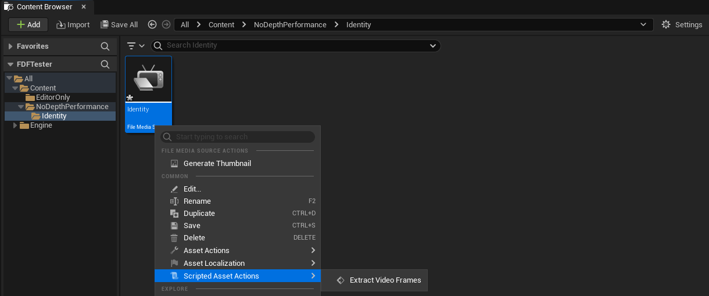

3. **Extract Frames with or without Audio**

   You’ll be prompted to choose whether to extract audio. For calibration or identity videos, audio is often unnecessary.

   
   

   After a successful operation, you’ll see an `ImgMediaSource` asset (e.g., **IMS-YourVideo_Video**).

    
    

   - If prompted with "Changes to source content files detected," click **Don't Import** to avoid Unreal importing these as textures.

   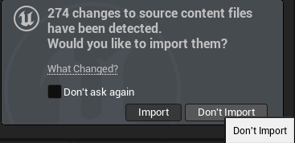

### 2. Create Depth Frames

1. **Initiate Depth Frame Creation**

   Right-click the generated `ImgMediaSource`, go to **Scripted Asset Actions**, and select **Start Creating Depth Frames**. This opens a new editor tab for configuring depth settings.

   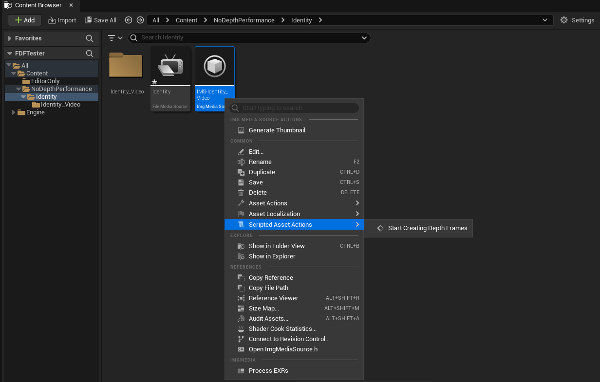

   - Note: If the MetaHuman Plugin is not enabled, the **Generate Capture Footage** button will be disabled. However, you can still convert video frames to depth frames.

   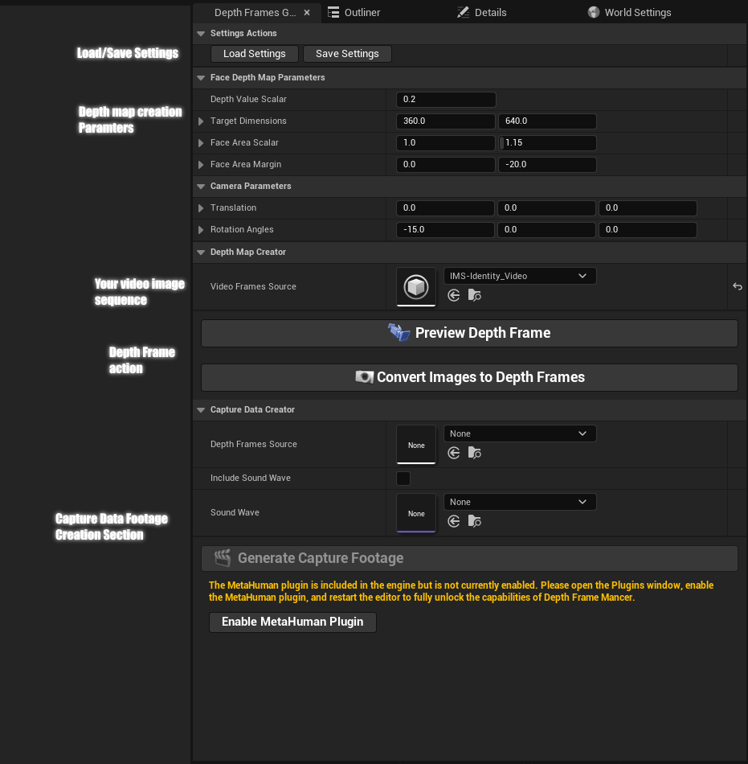

   

2. **Preview Depth Frame**

   The default **Face Depth Parameters** are tuned for iPhone 15. Hover over the settings for descriptions, then click `Preview Depth Frame` to display a sample frame with the generated depth map. The displayed mask should overlap accurately with the face in the video frame. If they do not align properly, adjust the **Face Depth Parameters** until you achieve an optimal fit.

   
   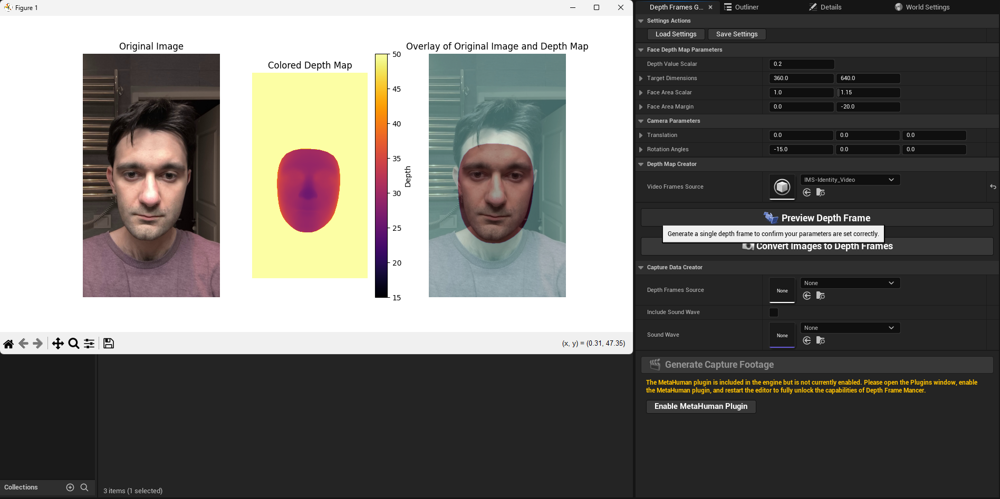

3. **Convert Images to Depth Frames**

   When satisfied with the preview, click `Convert Images to Depth Frames`. This may take some time.

   
   

   After processing, a new `ImgMediaSource` will appear (e.g., **IMS-YourVideo_Depth**).

   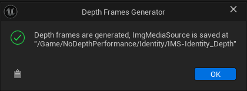
   

### 3. Create Capture Data Footage (With MetaHuman Plugin)

With the Epic Games MetaHuman Plugin enabled, you can create capture data footage from the plugin-generated media sources.

1. **Setup Capture Data Footage**

   Once depth frames are generated, the **Video Frames Source** and **Depth Frames Source** fields in the plugin UI will be populated. If not, set them manually and click `Create Capture Data Footage`.

   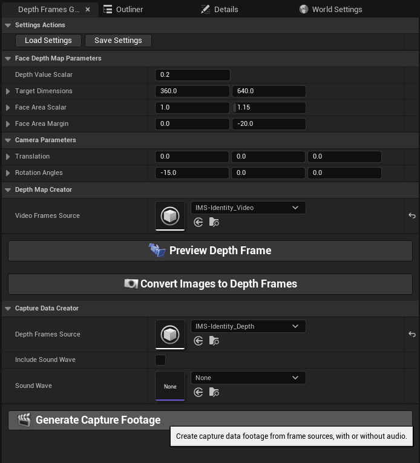

   This will create a `CaptureDataFootage` asset alongside your frame sequence assets. You’re now ready to use it for MetaHuman identity creation or to import performance video for MetaHuman animation!

   

   

   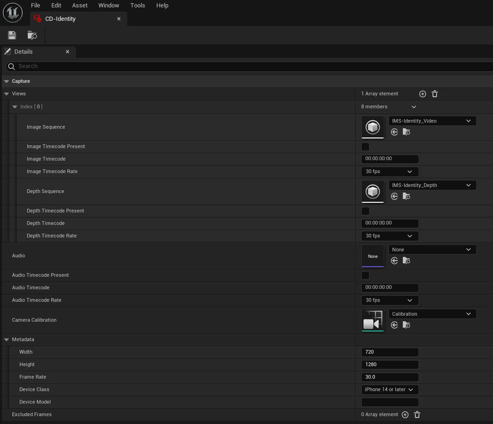

### 4. Plugin Settings

1. **Save and Load Settings**

   Save and load settings using the buttons in the plugin UI.

   
   
   

   

   These settings are saved as assets in your Content folder, allowing you to reuse them across different projects.

2. **Configure Settings in Project Settings**

   Go to **Project Settings > Plugin > MH Face Depth Frame Mancer** to set the default folder and asset name for depth map generation.

   

If you encounter any issues or problems with the plugin, [join the discord channel](https://discord.gg/pJc7gpGSWn).