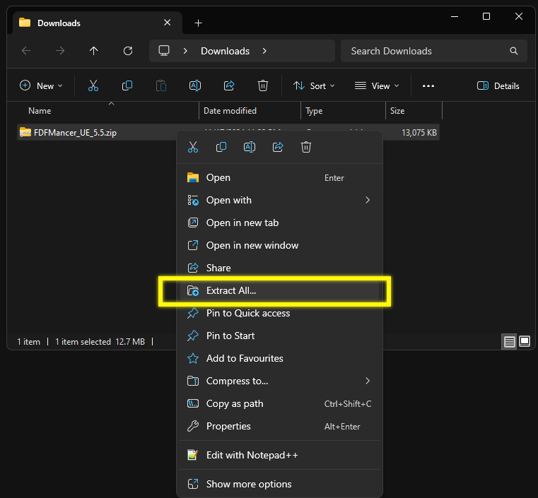
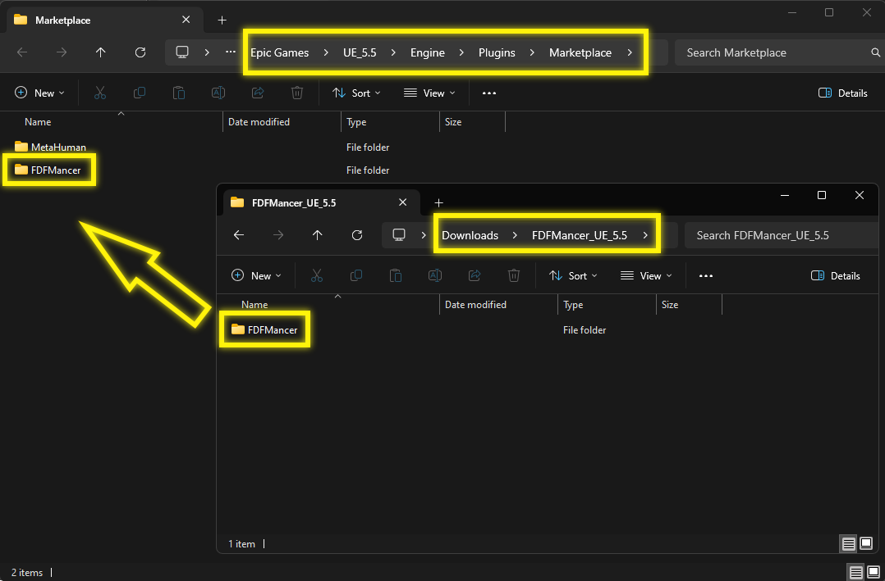

# Manual Installation Guide

Thank you for downloading the plugin! If you downloaded the plugin from a source other than the Fab Marketplace, follow the steps below to manually install it into the Unreal Engine so that it can be used with any project:

## Installation Steps
1. **Unzip the Plugin File**  
   Extract the contents of the downloaded `.zip` file. You will find `FDFMancer` folder in the extracted folder. 
   

2. **Paste into the Unreal Plugins Marketplace Directory**  
   Navigate to your Unreal Engine installation directory and paste the extracted folder into:  
   e.g., `Epic Games/<Version>/Engine/Plugins/Marketplace/`  

     

    ## Notes
    - If the `Marketplace` folder does not exist in the `Plugins` directory, you can create it manually.
    - Ensure you have the correct permissions to modify files in the Unreal Engine installation directory.  
    - Alternatively, if you prefer to use the plugin on a per-project basis, you can create a `Plugins` folder in your project directory and paste the extracted folder there.

3. **Continue to Usage**  
   For further instructions on how to use the plugin, refer to the [README](README.md) file under the "Installation" tab.
