# Face Depth Frame Mancer

## Version 2025.2.0

**Face Depth Frame Mancer** is an Unreal Engine plugin that generates **face depth frames** from video files **without the need for a depth camera**.
 It extracts **image frames**, **facial landmarks** and **audio**, creates **face depth frames** and **capture data footage**, and supports **MetaHuman camera calibrations for any video resolution or FPS**. This powerful tool enables the creation of **high-quality MetaHuman performances**, enhancing virtual characters and animation workflows.

### What's New in 2025.2.0

- **Refined Processing Pipeline**
  - FPS and resolution settings can now be edited in the project plugin settings for video frame extraction and custom camera calibration asset creation.
  - **Facial Landmark Extraction Process**: By default, facial landmark extraction is automatically applied after frame extraction, significantly accelerating the depth frame generation process compared to previous versions. This process can also be disabled if not needed.
  - New project settings provide greater flexibility, giving users more control over their configuration.
  
- **New Module: Quick Calibrator**
  - Users can now create custom camera calibrations, which support any video resolution and FPS for identity creation or performance processing.

- **UI Settings Now Save as Separate Assets**
  - UI settings can now be saved as separate assets, useful for users working with different cameras. Depth frame generation parameters often depend on the camera used, and these settings can be easily transferred between projects with camera calibration details.

- **Refined UI Parameters**
  - Significant improvements in UI parameters have been made. Please refer to the [Usage](#usage) section for more details.

- **Frame Mancer Advanced Actions**
  - New actions in the Frame Mancer allow users to clear Python cache from the editor.
  - Users can now reinstall 3rd party libraries and configure their versions to resolve any conflicts or uncompiled package issues.
  - These actions can be disabled via the project settings.

- **Updated Python Packages**
  - All included Python packages have been updated to their reliable versions.
  - Removed the **Trimesh 3rd Party Library** to enhance processing speed.

- **And More Improvements**  
  - A wide range of enhancements have been implemented to improve performance and usability.  
  - Various bug fixes have been addressed, including ensuring the plugin is now fully compatible with any project preset (e.g., Film/Video & Live Events, Architecture, or Simulation).

## Features

- **Extract Image Frames**: Extract frames from a video file and save them as `ImgMediaSource`.
- **Extract Audio**: Extract audio from the video file.
- **Create Depth Frames**: Generate face depth frames based on the video and save them as `ImgMediaSource`.
- **Custom Camera Calibration Assets**: Create and utilize custom camera calibration assets, allowing users to process videos with any aspect ratio and frame rate for identity creation and performance processing (requires the MetaHuman Plugin to be enabled).
- **Capture Data Footage**: Create a unified capture data asset combining video frames, depth frames, audio, and camera calibration (requires the MetaHuman Plugin to be enabled).
- **Sharable Settings**: Save and load depth map creation settings to share between projects.

## Installation

1. Open the Unreal Engine Editor.
2. Go to **Edit > Plugins**.
3. In the **Installed** tab, locate and enable the **MH Face Depth Frame Mancer** plugin.   
   - For full functionality, it’s recommended to also enable the **Epic Games MetaHuman Plugin**.
        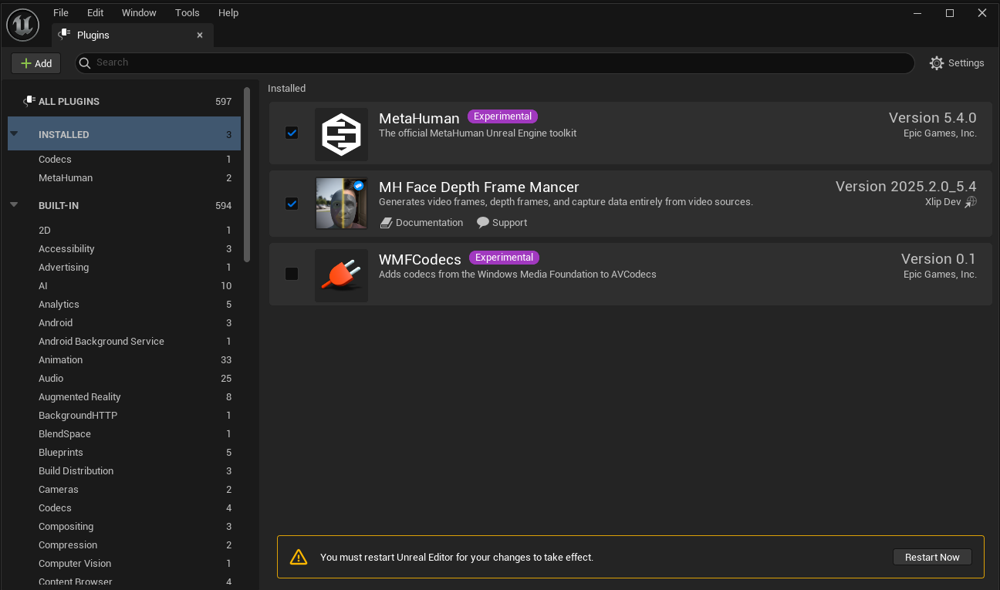

4. **Restart Unreal Engine if prompted.**

   > **Note:** When opening the project for the first time, Unreal Engine will automatically install the required Python packages, which may take some time. Please be patient during this process.

   The plugin depends on the following Python packages, which Unreal Engine will install in your project’s `Intermediate` folder:

   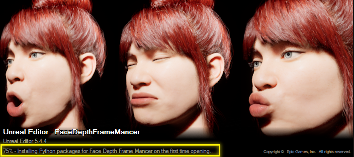
   - **opencv-python**: 4.10.0.84
   - **mediapipe**: 0.10.20
   - **matplotlib**: 3.10.0
   - **openexr**: 3.2.4
   - **imageio-ffmpeg**: 0.5.1

## Usage

   Before starting, review the following guidelines to ensure proper facial capture recording:  
   [MetaHuman Facial Performance Capture Guidelines](https://dev.epicgames.com/documentation/en-us/metahuman/metahuman-facial-performance-capture-guidelines#performerrequirements).  

   You can also watch the [How to Use MetaHuman Animator in Unreal Engine](https://youtu.be/WWLF-a68-CE) to learn how to record videos effectively.

### 1. Setup Frame Mancer Project Settings

1. **Open Edit -> Project Settings**  
2. **Navigate to Plugins -> MH Face Depth Frame Mancer**  

   On the left sidebar, scroll down to the **Plugins** section and locate **MH Face Depth Frame Mancer**.  

   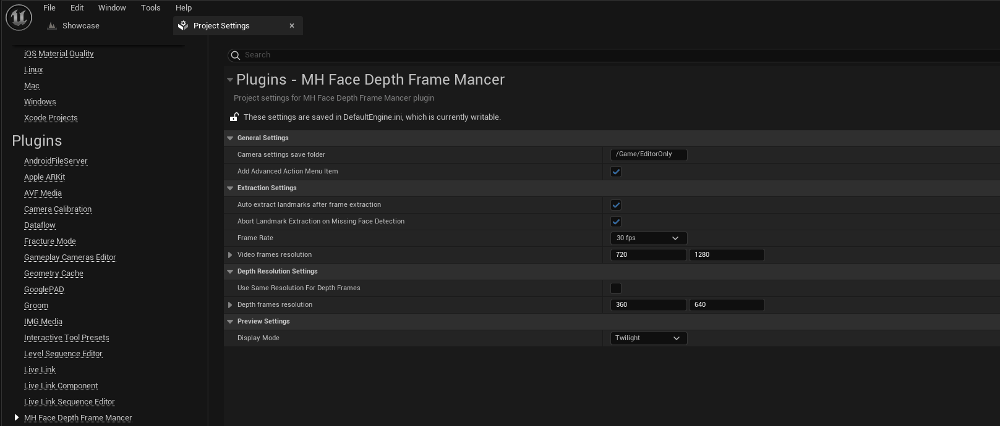  

   Explore the settings and hover over each option to view descriptions and tips.  

   - **Video Frames Resolution**: Set this according to your video's resolution.  
     - Ensure the same aspect ratio as your original video.  
     - You can upscale or downscale the resolution, which will scale your frames to the specified dimensions during frame extraction process.

   - **Depth Frames Resolution**: Adjust this to match your requirements.  
     - **Keep the aspect ratio consistent between video frames and depth frames.**  
     - While you can upscale or downscale depth frames resolution, high-resolution depth frames are not recommended as they require significant storage and may necessitate increasing the `IMG Media` plugin cache size.  

   - **Frame Rate**: Set this based on your needs.  
     - Frames will be extracted at the selected frame rate regardless of the original video's FPS.  
     - Higher FPS values will extract more frames, which can increase processing time.  

   **Default values:**  
   - **Aspect Ratio:** 9:16  
      - RGB Frame Resolution: 720x1280  
      - Depth Frame Resolution: 360x640  
   - **Frame Rate:** 30 FPS  

   **Tip:** Using half resolution (0.5 downscale) for depth frames is recommended for faster processing without significantly impacting quality.

   Adjust these settings to suit your video's requirements.

### 1. Extract Frames and Audio from Video

1. **Drag and Drop a Video into Content Browser**
   Place your video file in the Unreal Engine Content Browser, which will automatically create a `FileMediaSource` asset.

   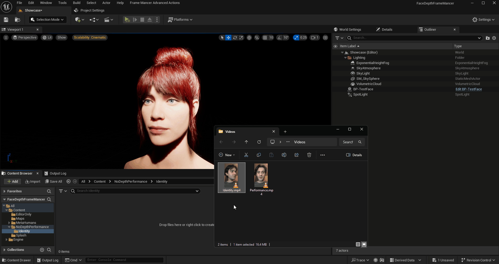

2. **Right-Click on the FileMediaSource**

   Go to **Scripted Asset Actions** and select **Extract Video Frames & Face Landmarks**.

3. When extracting, you’ll be prompted to choose whether to include audio. For identity videos, audio is typically unnecessary.  

4. After a successful operation, you’ll find an `ImgMediaSource` asset (e.g., **IMS-YourVideo_Video**) and two associated folders:  

   

   - **`_Video` Folder**:  
  Contains `.jpg` files (RGB frames). While the folder may appear empty in the editor, you can view its contents by selecting **Show in Explorer**.  

   - **`_Landmarks` Folder**:  
  Stores the facial landmark arrays for each frame. Landmarks are extracted sequentially and normalized.  

5.  If prompted with "Changes to source content files detected," click **Don't Import** to avoid Unreal importing these as textures.

      

### 2. Create Depth Frames

1. **Initiate Depth Frame Creation**

   Right-click the generated `ImgMediaSource` asset (ending with `_Video`), navigate to **Scripted Asset Actions**, and select **Depth Frames -> Start Creating Depth Frames**. This will open a new editor tab where you can configure depth settings. Arrange and place the tab wherever it’s most convenient for you.  

   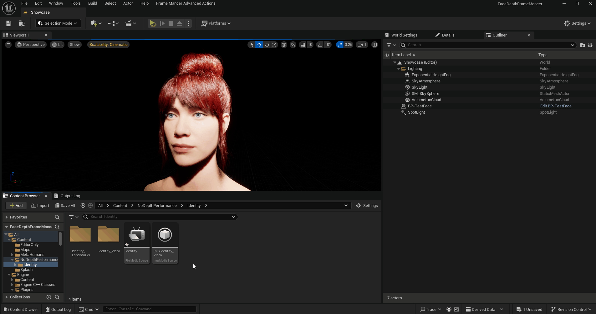  

      - **Note:**  
      If the MetaHuman Plugin is not enabled, the **Calibration Settings** and **Generate Capture Footage** sections will be unavailable. However, you can still convert video frames to depth frames.  

      

2. **Explore The Settings**

   Hover over the labels to view descriptions and tips. 

   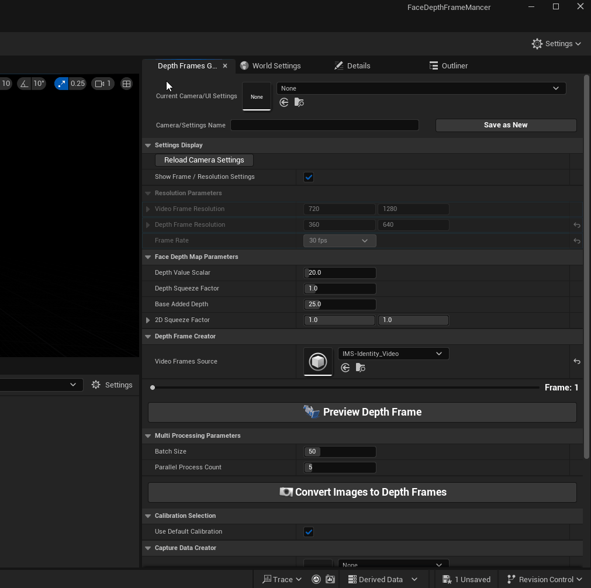

2. **Preview Depth Frame**

   The default **Face Depth Parameters** are optimized for the Xiaomi Redmi Note 13's front camera. Recommended cameras are standard phone front cameras with focal lengths of around 2–3 mm.  

   
   Click **Preview Depth Frame** to display a sample frame and its corresponding depth data. You can also drag the slider to preview any frame from your video.

   **Face Depth Parameters** are crucial for simulating a real depth camera accurately. You can estimate how many centimeters your face was from the camera while recording the video. Adjust the parameters while displaying a depth frame to find the correct values.  

   - **Recommended distance For Recordings:** 20–30 cm (from the tip of the nose to the camera).  
   - The difference between the closest depth (e.g., the tip of the nose) and the furthest depth (e.g., the ear) **is approximately 9-13** cm for an adult face.  

   - **Detailed Explanation of parameters**

      - **Depth Value Scalar**
      
         This value will be multiplied with the extracted landmark's z values (depth). So initially this controls the overall depth data. If your face is not moving forward or backward relatively to the camera (or if you are using a head mounted camera) keep this value low around 10-30. Which will help you to not to have jittery depth mesh.

         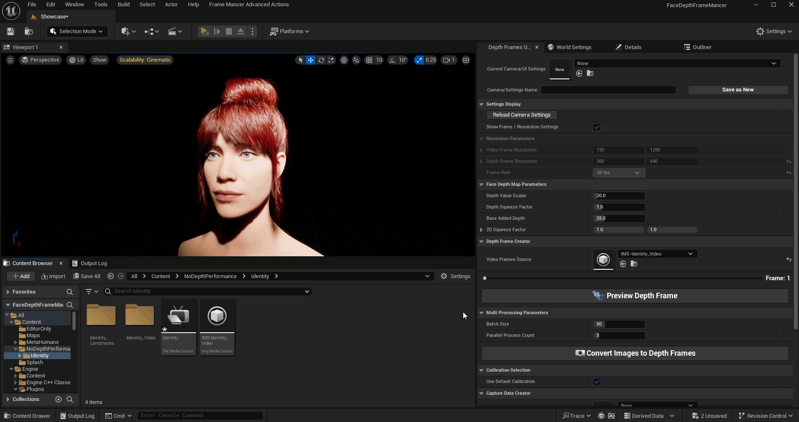

      - **Depth Squeeze Factor**
      
         Compresses the depth values relative to the lowest depth value. Use this setting alongside **Depth Value Scalar** and **Squeeze Factor** to simulate a real depth camera. Adjusting this value maintains the same lowest depth while scaling the relative depth differences.  

         If your **Depth Value Scalar** is large (around 80-100), consider lowering this value (around 0.1-0.2) to better match your face size. The goal is to find a balance between **Depth Squeeze Factor** and **Depth Value Scalar** to suit your specific needs.  

         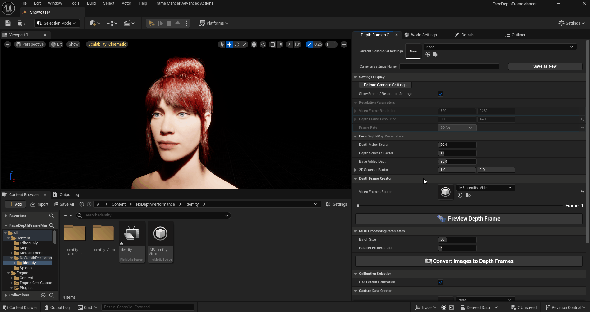

      - **Base Added Depth**
      
           Adds a value to the Z-axis landmark points to align the face position with the camera. This does not change the difference between depth values but moves the face mesh closer to or further away from the camera.  

           After determining the approximate 10 cm difference between the closest point (e.g., the tip of the nose) and the furthest depth (e.g., the ear), fine-tune this value to match the real-world distance of your face from the camera.

         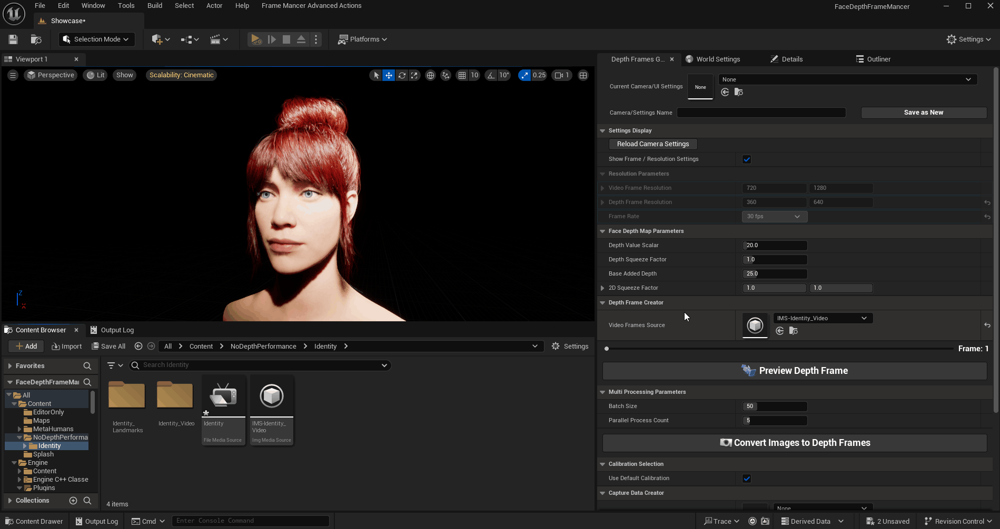    
         
      - **2D Squeeze Factor**
      
           Adjusts the depth mesh along the 2D axis without altering the depth values.

3. **Convert Images to Depth Frames**

   When satisfied with the preview, set the **Multi Processing Parameters** based on your CPU and RAM, then click **Convert Images to Depth Frames**.

   - **Batch Size**:
      Specifies the number of frames handled simultaneously in each process. Higher values increase memory usage.

   - **Parallel Process Count**:
      Defines the number of processes to run in parallel. Each process manages a "batch size" of images at a time. Adjust this based on your CPU cores to maximize efficiency.

   

   After processing, a new `ImgMediaSource` asset will be generated (e.g., **IMS-YourVideo_Depth**).

   **Important:** Do not rename or move the generated `ImgMediaSource` assets. These assets are tightly linked to their respective folders, and the plugin depends on the original naming conventions and locations to function properly.

   However, you are free to rename or move the created `Footage Capture Data` assets without affecting plugin operations.

### 3. Use Default Camera Calibration or Create New One

1. **Decide Creating custom Camera Calibration Asset**

   - **Use Default Calibration**

      **IMPORTANT!** The default calibration asset is configured for the default Frame Mancer frame settings (RGB Frame Res: `720x1280`, Depth Frame Res: `360x640`, FPS: `30`). If your extracted video frames have a different resolution/FPS or you've set a custom depth resolution, you **must** create a new camera calibration asset by deselecting this option.

2. **Create Quick Calibration**

   Creating a calibration is strongly recommended for perfectly aligned MetaHuman identity results. You can specify a camera name and click **1. Create Quick Calibration**. This will generate a MetaHuman Camera Calibration asset in the directory of your depth `ImgMediaSource` (ending with `_Depth`).

   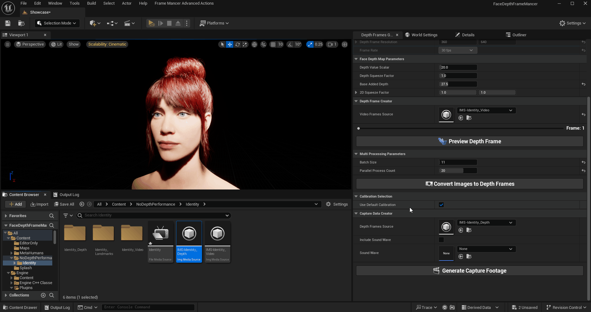

3. **Advanced Calibration** 

   If you wish to experiment with other device classes or options, click **2. Advanced Calibration**. This will open a new widget where you can configure all the values to create the camera calibration asset, allowing you to save it wherever you prefer.

   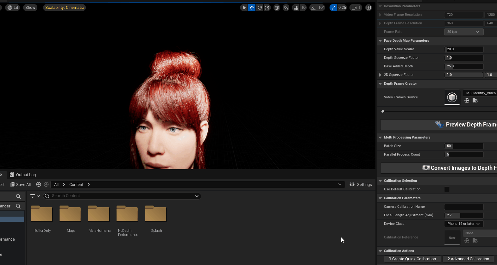

   
### 4. Generate Capture Footage and Start Creating MH Identity

   Once the depth frames are generated, the **Video Frames Source** and **Depth Frames Source** fields in the plugin UI will be populated. If not, set them manually and click **Create Capture Data Footage**. This will create a `Capture Data Footage` asset, which is a wrapper object that holds references to your video frame source assets and camera calibration asset. Afterward, you can create a MetaHuman Identity Asset to use the generated footage.

   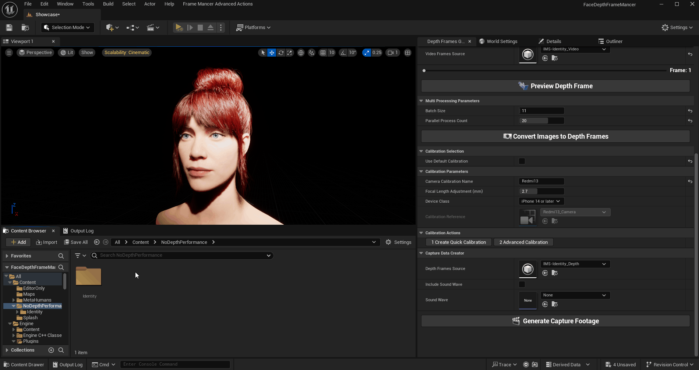

### 5. Create your MetaHuman Skeletal Mesh

   1. Check your depth frames to ensure they look realistic and that the depth values are correct by reviewing them from side views. 

      

   2. **Promote Frames** (Front, Slightly to the Left, and Right; at least 3 frames)

      

   3. **Identity Solve & Mesh to MetaHuman**  

      Click `MetaHuman Identity Solve`, select a body type, and then click `Mesh to MetaHuman` to create your skeletal mesh using the Epic Games MetaHuman backend.

      

   4. **Check your Skeletal Mesh and Adjust Focal Length If needed**

       

      If you encounter warnings about the size of the generated `Skeletal Mesh`,
      it typically indicates that some values need adjustment. 
      Start by verifying your depth values, focusing on the distance of the face from the camera and the size of the face (specifically, the distance between the closest and furthest points).  

      

            Note: A larger focal length results in a narrower field of view. If the warning indicates that the generated mesh is larger than usual, it means that the focal length in the calibration asset is smaller than your camera's actual focal length. This discrepancy causes the MetaHuman backend to interpret the face as being farther away from the camera during skeletal mesh generation. Consequently, it scales the mesh larger to align with the depth data. In this case, increase the focal length adjustment and update the calibration asset.  

            On the other hand, if the warning indicates that the generated mesh is smaller than usual, it means the focal length in the calibration asset is larger than your camera's focal length. This causes the MetaHuman backend to interpret the face as being closer to the camera, leading it to scale the mesh down to match the depth data. In this case, decrease the focal length adjustment and update the calibration asset.  

      After adjusting the focal length and updating your Camera Calibration, follow these steps:

      1. Click **MetaHuman Identity Solve** to apply the new calibration.

      2. Then, click **Mesh to MetaHuman** to update the skeletal mesh based on the updated calibration settings.

      

      Try updating the focal length calibration and skeletal mesh as much as needed to achieve a good match between the generated mesh and your footage. 

      **Tip:** Make sure the head size is accurate in comparison to the footage, and check that the ears start at the same position and are approximately the same size.

      

   5. **Add Teeth Pose And Fit Teeth**

      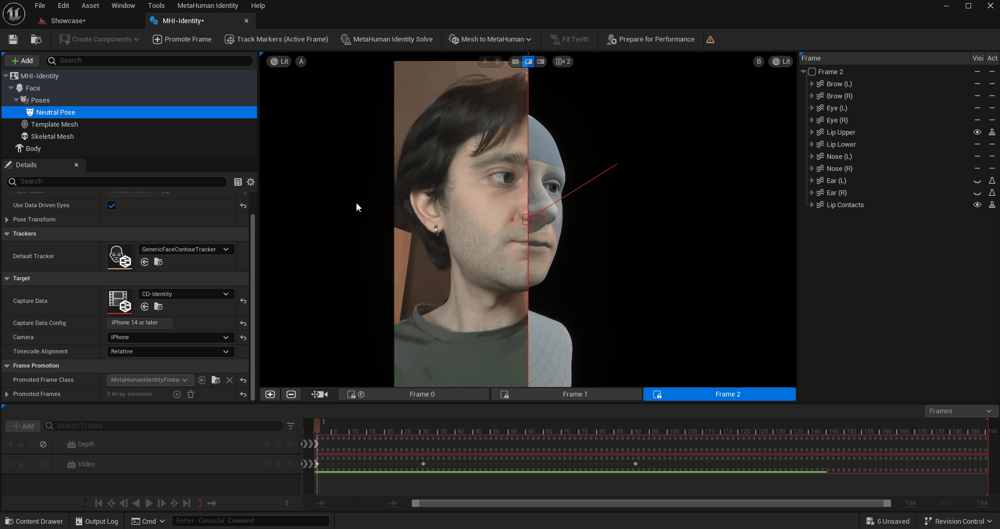

   6. **Finally Prepare Your MH Identity For Performance**

      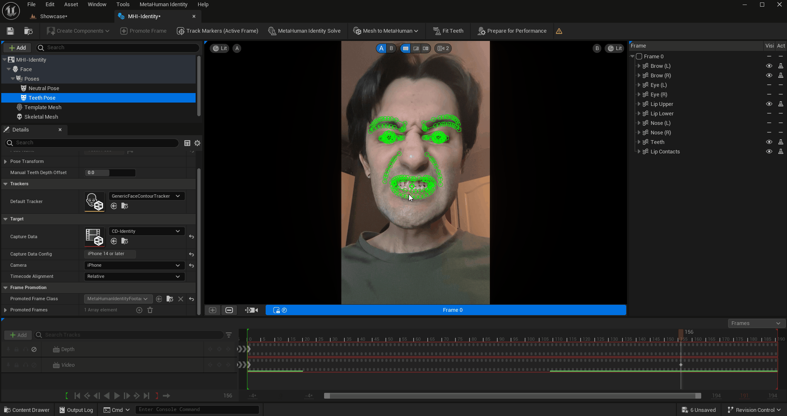

### 6. Extract And Process Performance Frames

   1. Apply the same steps for the performance video. (Frame & Landmark extraction) The only adjustment you might need is to the **Base Added Depth**, especially if you recorded the videos with the same camera but from different distances.

   2. Before converting all frames, click **Preview Depth Frame** to verify the distances and ensure everything looks correct.

      For optimal results, record both the identity and performance videos back-to-back using the same camera, ensuring the face-to-camera distance remains unchanged. This avoids the need for additional adjustments. However, if necessary, you can fine-tune the Face Depth Map Parameters to align with real-world dimensions before processing your frames. 
      
      You can also use a single video that includes both your identity and performance frames. During the performance processing, you have the option to bypass the identity frames as needed.

      

   3. Create your performance footage and a `MetaHuman Performance` asset. Open the performance asset and set the performance footage and the Identity that was prepared for the performance.

      

   4. Finally Process your performance and check the results.

      

### 7. Saving UI Settings

   1. **Save your settings:** Provide a name for your settings and click **Save as New**.  

      Saves or updates the current Camera/Plugin UI parameters to an object, enabling you to store settings for different cameras individually. By default, the object is saved in the **Content/EditorOnly** folder, but this can be modified in **Project Settings -> Plugins -> MH Depth Frame Mancer**.

      Saved Options:
         - Resolution Parameters (pulled from current project settings)
         - Face Depth Map Parameters
         - Multi Processing Parameters
         - Calibration Selection
         - Calibration Parameters (if any)

      This action creates a Blueprint asset in the `Content/EditorOnly` folder by default. You can change this location in **Project Settings > Plugins > MH Face Depth Frame Mancer**.  

        

   2. **Review your saved settings:** Open the created asset to view the saved UI settings.

### 8. Frame Mancer Advanced Actions

   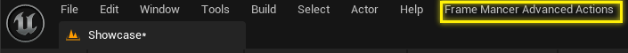

   1. **Clear Python Cache**

      This action clears the Python cache folder from the plugin's `Content/Python` directory. It is recommended to perform this action before reinstalling third-party libraries.

   

   2. **Reinstall 3rd Party Libraries**

      This action opens a new widget that allows you to set the versions for the third-party libraries used. If you encounter any issues with uncompiled versions, you can visit the pip website and select a different version for these packages.

      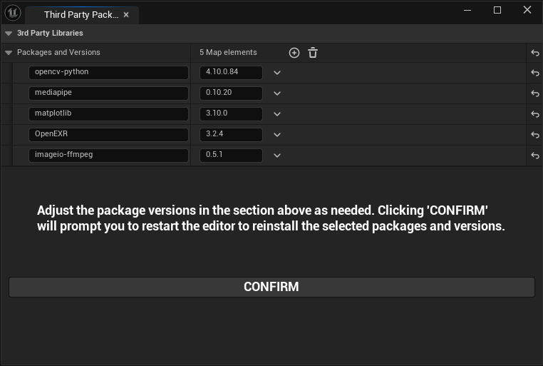

### 9. Working With Different Resolution Videos

1. **Close the Depth Frames Generator window:** Ensure the **Depth Frames Generator** editor window is closed.  
2. **Update resolutions:** Navigate to **Project Settings > Plugins > MH Face Depth Frame Mancer** and set your desired resolutions for both video and depth frames.  
3. **Start fresh** Begin from scratch by extracting your videos to ensure compatibility with the new settings.  
4. **Verify updated settings:**  
   - When you click **Start Creating Depth Frames**, the editor window will reopen.
   - Confirm that the **Resolution Parameters** section reflects your updated resolutions.  

   **Note:** If the `Current Camera/UI Settings` asset is selected in the plugin UI, the resolution parameters will also be saved within this asset. To apply the updated project settings, clear the selected asset and click **Reload Camera Settings** in the UI.  

## FAQ

### Question 1: I bought the plugin. Can I download the new version, or do I need to buy it again?  
**Answer:**  
No need to buy it again! Once you get the plugin, you’ll get access to all future updates. When a new version is released, you can use the existing link to download the new versions/content.

### Question 2: Can I use this offline?
**Answer:**  
Yes. If you open the project for the first time, you will need an internet connection to install third-party libraries. After that, you can use it offline to generate depth frames. However, keep in mind that MetaHuman Identity and Performance assets require a connection to the Unreal Engine MetaHuman backend.

### Question 3: Is the plugin a bridge to an online service?
**Answer:**  
No! The plugin operates entirely on your computer, and all depth frames are generated locally. It does not send any data to the creator or any other online services while generating depth frames. You can use it offline.

### Question 4: Can the plugin be used in real-time with a video stream?  
**Answer:**  
No, the plugin currently operates by extracting frames and landmarks, and generating depth frames to create a depth footage asset compatible with the MetaHuman pipeline. At this time, only pre-recorded videos are supported.

## SUPPORT

If you encounter any issues, problems, or have suggestions with the plugin, please [join the Discord channel](https://discord.gg/pJc7gpGSWn). Alternatively, you can contact me through social media or email.

E-Mail: [xlip.studio@gmail.com](xlip.studio@gmail.com)

[Youtube and other social media links](https://www.youtube.com/@xlipdev/about)